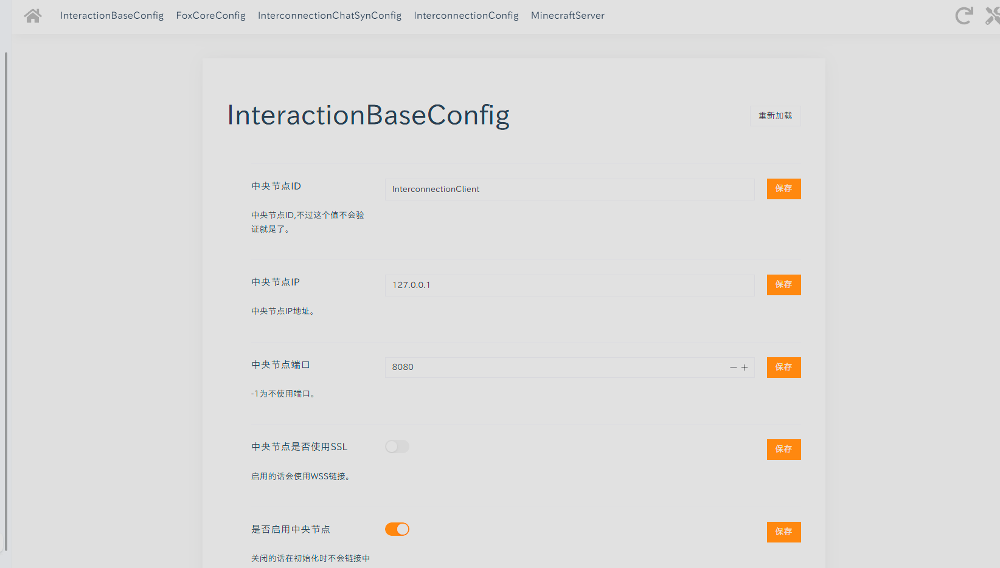
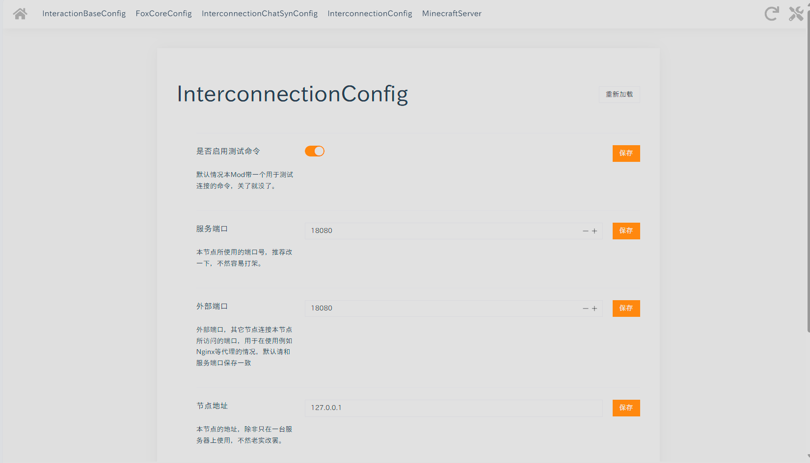

# Interconnection 互联核心
## 简介
互联核心是一个用于在多服务端间进行自组网数据交互的Mod/Plugin，当前已支持NeoForge、Fabric和Paper(使用了Paper特有API)。
对于Velocity和BungeeCord的支持正在工作的。  
核心本身只有组网功能。

## 功能
现在只有三个指令以供测试，分别是：
```bash
interconnection test <Value> #用于发送测试数据，会在所有已连接的节点上打印出来
interconnection list #用于列出所有已连接的节点
interconnection update #用于更新本节点在其它节点的数据，没事别用这个，有自动更新的
```
## 开发
请加入以下Maven仓库：
```groovy
    maven {url "https://git.foxapplication.com/api/packages/koro/maven"}
```
并添加以下依赖：
```groovy
    implementation "com.foxapplication.mc:foxcore:1.0.1"
    implementation "com.foxapplication.mc:interaction-base:1.2.1"
    implementation "com.foxapplication.mc:interconnectioncommon:1.0.1"
    implementation "com.foxapplication.mc:interconnection{对应加载器}:1.0.1"
```
## 使用
**推荐使用Web配置系统**，因为其能更有效的编辑你需要的配置，并具有更好的可视化界面与翻译。
### InteractionBaseConfig
这是**Interaction**的配置文件，对于使用者来说，只需要关注以下几个配置项，其它请保持默认：
1. 中央节点ID
2. 中央节点IP
3. 中央节点端口
4. 中央节点是否使用SSL
5. 是否启用中央节点
6. 网络Token

#### 是否启用中央节点
如果当前节点为中央节点，请关闭这个选项。
****
以下内容只需要在从节点配置，中央节点无需配置 。
#### 中央节点ID
请务必确保中央节点ID与真正的中央节点ID一致，否则将无法工作。
#### 中央节点IP
中央节点的IP地址，也可以是域名。
#### 中央节点端口
中央节点的端口，-1为不使用端口。
#### 中央节点是否使用SSL
是否使用SSL连接中央节点，也就是会使用wss的前缀。
#### 网络Token
用于验证网络连接，一个网络中所有节点的Token必须一致，否则将无法工作。
#### 例子
假设在内网中有一个未使用SSL的中央节点，IP为192.168.1.1，端口为8080，ID为Center，Token为1234567890，那么InteractionBaseConfig设置应该为：

1. 中央节点ID = Center
2. 中央节点IP = 192.168.1.1
3. 中央节点端口 = 8080
4. 中央节点是否使用SSL = false
5. 是否启用中央节点 = true
6. 网络Token = 1234567890

假设在网络中有一个启用了ssl（可以使用Nginx代理，在后文会描述）的中央节点，域名为ws.example.com，使用端口为443（默认https端口），ID为Center，Token为1234567890，那么InteractionBaseConfig设置应该为：

1. 中央节点ID = Center
2. 中央节点IP = ws.example.com
3. 中央节点端口 = -1
4. 中央节点是否使用SSL = true
5. 是否启用中央节点 = true
6. 网络Token = 1234567890

以下是对应的Web配置系统预览：

### InterconnectionConfig
这是 **Interconnection 互联核心**的配置文件，用于配置本节点的具体配置，依旧推荐使用Web配置系统。  
只需要关注以下配置：
1. 服务端口
2. 外部端口
3. 节点地址
4. 节点ID

#### 服务端口
提供服务的端口，默认为18080，在一台服务器上必须唯一。
#### 外部端口
供外部访问的端口，-1为不使用，在不使用代理的情况下请保证与服务端口一致。
#### 节点地址
节点地址，可以是域名或IP，供外部访问。
#### 节点ID
节点ID，用于标识当前节点，在一个网络中节点ID必须**唯一**。
以下是对应的Web配置系统预览：
